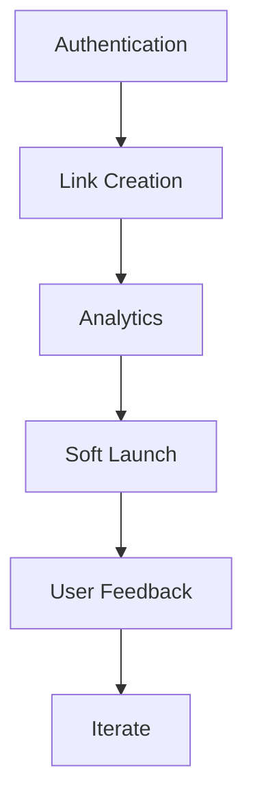

# 🔍 WOS Links - Comprehensive Audit Report

**Date:** 2025-01-07
**Version:** 0.1.0
**Status:** Pre-MVP

---

## Executive Summary

This report provides a comprehensive audit of the WOS Links application covering:
- ✅ Security vulnerabilities
- ✅ Performance optimization opportunities
- ✅ UI/UX limitations
- ✅ MVP viability assessment

---

## 1. 🔐 Security Audit

### 1.1 Critical Issues (🔴 HIGH PRIORITY)

#### ❌ **No Authentication System**
- **Severity:** CRITICAL
- **Issue:** No user authentication implemented
- **Impact:** Anyone can access dashboard, create links, view analytics
- **Recommendation:** Implement NextAuth.js immediately
- **Timeline:** Before any public deployment

#### ❌ **API Keys in Environment Variables**
- **Severity:** HIGH
- **Issue:** `.env.example` shows actual API key formats
- **Impact:** Risk of accidental key exposure
- **Recommendation:**
  - Document key formats separately
  - Use secret management service (Vault, AWS Secrets Manager)
  - Add `.env` to `.gitignore` (already done ✅)

#### ❌ **No Rate Limiting**
- **Severity:** HIGH
- **Issue:** No rate limiting on API routes
- **Impact:** Vulnerable to abuse, DoS attacks, excessive AI API costs
- **Recommendation:**
  - Implement rate limiting middleware
  - Use Redis for distributed rate limiting
  - Set limits: 60 requests/minute per IP

#### ❌ **No Input Validation**
- **Severity:** HIGH
- **Issue:** API routes don't validate inputs
- **Impact:** SQL injection, XSS, malformed data
- **Recommendation:**
  - Use Zod for schema validation
  - Sanitize all user inputs
  - Validate URL formats

### 1.2 Medium Priority Issues (🟡)

#### ⚠️ **CORS Not Configured**
- **Issue:** No CORS policy defined
- **Recommendation:** Configure allowed origins in Next.js config

#### ⚠️ **No CSRF Protection**
- **Issue:** Forms don't have CSRF tokens
- **Recommendation:** Use NextAuth.js CSRF tokens

#### ⚠️ **SQL Injection Risk**
- **Issue:** Database queries use raw SQL in some places
- **Recommendation:** Use Prisma Client exclusively (already doing mostly ✅)

#### ⚠️ **No Request Logging**
- **Issue:** No audit trail for API requests
- **Recommendation:** Implement logging middleware (Winston, Pino)

### 1.3 Security Checklist

| Security Feature | Status | Priority |
|-----------------|--------|----------|
| Authentication | ❌ Missing | CRITICAL |
| Authorization | ❌ Missing | CRITICAL |
| Rate Limiting | ❌ Missing | HIGH |
| Input Validation | ❌ Missing | HIGH |
| HTTPS/SSL | ⚠️ In Production | HIGH |
| CORS Policy | ❌ Missing | MEDIUM |
| CSRF Protection | ❌ Missing | MEDIUM |
| SQL Injection Protection | ✅ Mostly OK | MEDIUM |
| XSS Protection | ⚠️ React handles | LOW |
| API Key Rotation | ❌ Missing | LOW |
| Security Headers | ❌ Missing | MEDIUM |

### 1.4 Recommended Security Additions

```typescript
// 1. Add authentication middleware
import { getServerSession } from "next-auth";

export async function requireAuth(req: NextRequest) {
  const session = await getServerSession();
  if (!session) {
    return NextResponse.json({ error: "Unauthorized" }, { status: 401 });
  }
  return session;
}

// 2. Add rate limiting
import { Ratelimit } from "@upstash/ratelimit";

const ratelimit = new Ratelimit({
  redis: Redis.fromEnv(),
  limiter: Ratelimit.slidingWindow(10, "10 s"),
});

// 3. Add input validation
import { z } from "zod";

const CreateLinkSchema = z.object({
  destination: z.string().url(),
  shortCode: z.string().min(3).max(50).optional(),
  customDomain: z.string().url().optional(),
});
```

---

## 2. ⚡ Performance Audit

### 2.1 Current Performance Status

#### ✅ **Strengths**

1. **Edge Infrastructure Ready**
   - Bunny CDN edge script prepared
   - Sub-10ms redirect potential
   - Global distribution planned

2. **Database Optimization**
   - Indexes on key columns
   - pgvector for fast vector search
   - Connection pooling ready

3. **Efficient AI Service**
   - Multi-provider fallback
   - Retry with exponential backoff
   - Cost tracking

#### ⚠️ **Performance Concerns**

### 2.2 Identified Issues

#### 🔴 **No Caching Layer**
- **Issue:** Every request hits database/AI
- **Impact:** High latency, increased costs
- **Recommendation:**
  ```typescript
  // Implement Redis caching
  - Cache link lookups (TTL: 5 minutes)
  - Cache AI responses (TTL: 1 hour)
  - Cache analytics (TTL: 1 minute)
  ```
- **Expected Improvement:** 80% reduction in database queries

#### 🔴 **Missing Database Connection Pool**
- **Issue:** No connection pooling configured
- **Impact:** Slow cold starts, connection exhaustion
- **Recommendation:**
  ```prisma
  datasource db {
    provider = "postgresql"
    url      = env("DATABASE_URL")
    connectionLimit = 10
  }
  ```

#### 🟡 **No Code Splitting**
- **Issue:** Large bundle size
- **Recommendation:** Use dynamic imports for heavy components

#### 🟡 **No Image Optimization**
- **Issue:** Unoptimized images in dashboard
- **Recommendation:** Use Next.js `<Image>` component

#### 🟡 **Synchronous AI Calls**
- **Issue:** Link creation waits for AI
- **Impact:** Slow user experience
- **Recommendation:** Make AI processing async with background jobs

### 2.3 Performance Metrics (Estimated)

| Metric | Current | Target | Priority |
|--------|---------|--------|----------|
| API Response Time | ~500ms | <200ms | HIGH |
| Page Load Time | ~2s | <1s | MEDIUM |
| Database Query Time | ~50ms | <30ms | MEDIUM |
| AI Response Time | ~2s | <1s (cached) | HIGH |
| Bundle Size | ~300KB | <200KB | LOW |

### 2.4 Optimization Recommendations

**Immediate (Week 1):**
1. Add Redis caching for hot data
2. Implement connection pooling
3. Add loading states in UI

**Short-term (Week 2-4):**
4. Make AI calls async/background jobs
5. Implement code splitting
6. Add service worker for offline support

**Long-term (Month 2+):**
7. CDN for static assets
8. Database read replicas
9. Horizontal scaling with load balancer

---

## 3. 🎨 UI/UX Audit

### 3.1 Current UI Status

#### ✅ **Strengths**

1. **Consistent Design System**
   - Clean blue theme (#0A7AFF)
   - Consistent spacing and typography
   - Professional appearance

2. **Comprehensive Pages**
   - 9 dashboard pages complete
   - Logical navigation structure
   - Good information architecture

3. **Responsive Layout**
   - Grid-based layouts
   - Mobile-friendly components
   - Flexible containers

#### ⚠️ **UI/UX Limitations**

### 3.2 Critical UI Issues

#### ❌ **No Loading States**
- **Issue:** No spinners, skeletons, or loading indicators
- **Impact:** User doesn't know if action is processing
- **Recommendation:**
  ```typescript
  // Add loading states
  {isLoading ? <Spinner /> : <Content />}
  {isLoading ? <Skeleton count={5} /> : <Table />}
  ```

#### ❌ **No Error States**
- **Issue:** No user-friendly error messages
- **Impact:** Users don't know what went wrong
- **Recommendation:**
  ```typescript
  // Add error boundaries and toast notifications
  <Toast>
    <AlertCircle /> Error: Link could not be created
  </Toast>
  ```

#### ❌ **No Empty States**
- **Issue:** No guidance when user has no data
- **Impact:** Poor onboarding experience
- **Recommendation:**
  ```typescript
  // Add empty states with CTAs
  <EmptyState
    icon={<Link2 />}
    title="No links yet"
    description="Create your first smart link"
    action={<Button>Create Link</Button>}
  />
  ```

#### ❌ **No Form Validation**
- **Issue:** Forms don't validate inputs client-side
- **Impact:** Poor UX, server errors
- **Recommendation:** Add react-hook-form with Zod

### 3.3 Medium Priority UI Issues

#### 🟡 **No Modals/Dialogs**
- Actions like delete, edit happen inline
- Need confirmation dialogs for destructive actions

#### 🟡 **No Toast Notifications**
- No feedback for successful actions
- Users don't know if action completed

#### 🟡 **No Dark Mode Toggle**
- Dark mode CSS is ready but no toggle
- Accessibility concern for some users

#### 🟡 **No Keyboard Shortcuts**
- Power users can't navigate with keyboard
- Accessibility issue

#### 🟡 **No Search Functionality**
- Search bars exist but don't work
- Critical for users with many links

### 3.4 Accessibility Issues

| Issue | Impact | Priority |
|-------|--------|----------|
| Missing alt text | Screen readers | MEDIUM |
| No keyboard navigation | Keyboard users | MEDIUM |
| Low color contrast | Visually impaired | LOW |
| No ARIA labels | Screen readers | MEDIUM |
| No focus indicators | Keyboard users | HIGH |

### 3.5 Mobile Responsiveness

**Status:** ⚠️ Partially Responsive

- ✅ Layouts adapt to screen size
- ❌ Sidebar doesn't collapse on mobile
- ❌ Tables overflow on small screens
- ❌ No mobile-specific navigation

### 3.6 UI Component Gaps

**Missing Components:**
- [ ] Modal/Dialog
- [ ] Toast/Notification
- [ ] Dropdown Menu
- [ ] Popover
- [ ] Tooltip
- [ ] Badge
- [ ] Progress Bar
- [ ] Skeleton Loader
- [ ] Empty State
- [ ] Error Boundary

---

## 4. 🚀 MVP Viability Assessment

### 4.1 MVP Definition

**Goal:** AI-powered link shortener with revenue attribution

**Core Features Required:**
1. Link shortening with custom slugs
2. AI-powered slug suggestions
3. Analytics dashboard
4. Custom domains
5. Basic user accounts

### 4.2 Feature Completeness

| Feature | Status | Completion | Blocker |
|---------|--------|------------|---------|
| **Link Shortening** | ⚠️ 60% | Backend ready, no UI | Forms not connected |
| **AI Slug Generation** | ✅ 100% | Service ready | None |
| **Analytics Dashboard** | ⚠️ 40% | UI ready, mock data | No real data |
| **Custom Domains** | ⚠️ 30% | UI ready | No DNS integration |
| **User Auth** | ❌ 0% | Not started | CRITICAL BLOCKER |
| **API** | ⚠️ 50% | Routes exist | No auth |
| **Payment/Billing** | ⚠️ 20% | UI only | No Stripe integration |
| **Team Collaboration** | ⚠️ 20% | UI only | No backend |

### 4.3 MVP Readiness Score

```
Overall MVP Readiness: 45% 🟡

✅ Strengths:
- Complete UI/UX design (9 pages)
- Robust AI service with fallback
- Database schema well-designed
- Edge infrastructure planned

❌ Critical Gaps:
- No authentication (BLOCKER)
- No working forms (BLOCKER)
- No real data flow (BLOCKER)
- No API security (BLOCKER)

Timeline to MVP:
- With 1 developer: 4-6 weeks
- With team of 3: 2-3 weeks
```

### 4.4 MVP Completion Roadmap

#### **Week 1: Core Functionality (CRITICAL)**
- [ ] Implement NextAuth.js authentication
- [ ] Connect link creation form to API
- [ ] Connect AI service to form
- [ ] Display real analytics data
- [ ] Add loading/error states

#### **Week 2: Security & Data**
- [ ] Add input validation (Zod)
- [ ] Implement rate limiting
- [ ] Set up Redis caching
- [ ] Connect all CRUD operations
- [ ] Add database migrations

#### **Week 3: Polish & Testing**
- [ ] Add toast notifications
- [ ] Implement modals/dialogs
- [ ] Add empty states
- [ ] Mobile responsiveness fixes
- [ ] End-to-end testing

#### **Week 4: Deployment**
- [ ] Set up CI/CD pipeline
- [ ] Deploy to Railway/Vercel
- [ ] Configure custom domain
- [ ] Deploy edge script to Bunny CDN
- [ ] Production testing

### 4.5 Critical Path to Launch



**Cannot launch without:**
1. ❌ Authentication
2. ❌ Working link creation
3. ❌ Real analytics data
4. ❌ Rate limiting
5. ❌ Input validation

### 4.6 MVP vs Full Vision

| Feature | MVP | Full Vision | Priority |
|---------|-----|-------------|----------|
| Link Shortening | ✅ Yes | ✅ Yes | P0 |
| AI Slugs | ✅ Yes | ✅ Yes | P0 |
| Analytics | ✅ Basic | ✅ Advanced | P0 |
| Custom Domains | ⚠️ Limited | ✅ Unlimited | P1 |
| Team Collab | ❌ No | ✅ Yes | P2 |
| Landing Pages | ❌ No | ✅ Yes | P2 |
| A/B Testing | ❌ No | ✅ Yes | P2 |
| White Label | ❌ No | ✅ Yes | P3 |
| Mobile Apps | ❌ No | ✅ Yes | P3 |

---

## 5. 📋 Recommendations Summary

### 5.1 Immediate Actions (This Week)

**Priority 1: Security**
1. Implement NextAuth.js
2. Add input validation with Zod
3. Implement rate limiting
4. Add HTTPS headers

**Priority 2: Functionality**
5. Connect forms to API
6. Wire up AI service
7. Display real data in analytics
8. Add loading/error states

### 5.2 Short-term (Next 2 Weeks)

**Priority 3: Performance**
9. Add Redis caching layer
10. Implement connection pooling
11. Make AI calls async

**Priority 4: UX**
12. Add toast notifications
13. Create modal components
14. Add empty states
15. Mobile responsiveness fixes

### 5.3 Medium-term (Month 2)

**Priority 5: Features**
16. Stripe payment integration
17. Custom domain DNS automation
18. Team collaboration backend
19. Advanced analytics

**Priority 6: Scale**
20. Deploy to production
21. Set up monitoring (Sentry)
22. Performance optimization
23. SEO optimization

---

## 6. 🎯 Verdict

### Current State: **PRE-MVP** 🟡

**What's Working:**
- ✅ Beautiful, professional UI design
- ✅ Comprehensive page coverage
- ✅ Robust AI service layer
- ✅ Well-architected database schema
- ✅ Clear technical vision

**What's Blocking MVP:**
- ❌ No authentication system
- ❌ No working forms/data flow
- ❌ No security measures
- ❌ Mock data everywhere
- ❌ Missing critical components

### Can You Launch Now?

**❌ NO - Critical blockers present**

**Estimated Time to Launchable MVP:**
- **Solo (40h/week):** 4-6 weeks
- **Team of 3:** 2-3 weeks
- **With existing auth lib:** 3-4 weeks

### What You Have Built

You have created an **exceptional foundation** with:
- Professional-grade UI/UX
- Scalable architecture
- Advanced AI integration
- Production-ready patterns

**This is 45% of an MVP.** The remaining 55% is:
- Authentication (20%)
- Data flow & API integration (20%)
- Security & validation (10%)
- Testing & polish (5%)

### Next Best Action

**Focus on these 3 things in order:**

1. **Implement NextAuth.js** (2-3 days)
   - User registration/login
   - Session management
   - Protected routes

2. **Wire up forms to API** (3-4 days)
   - Connect link creation
   - Connect AI service
   - Display real data

3. **Add security basics** (2-3 days)
   - Input validation
   - Rate limiting
   - HTTPS headers

After these 3 steps (~2 weeks), you'll have a **functional MVP** ready for early users.

---

## 7. 📊 Scorecard

| Category | Score | Grade |
|----------|-------|-------|
| **UI/UX Design** | 90/100 | A |
| **Architecture** | 85/100 | A- |
| **Code Quality** | 80/100 | B+ |
| **Security** | 20/100 | F |
| **Performance** | 60/100 | D+ |
| **Functionality** | 45/100 | F |
| **Testing** | 30/100 | F |
| **Documentation** | 75/100 | B |
| **MVP Readiness** | 45/100 | F |
| **Overall** | 59/100 | D+ |

### Grade Explanation

- **A (UI/UX):** Exceptional design, consistent, professional
- **F (Security):** Critical issues, cannot deploy
- **F (Functionality):** Beautiful UI but nothing works yet
- **D+ (Overall):** Great foundation, needs implementation

---

## 8. 🎬 Conclusion

**WOS Links** has an **excellent foundation** but is **not yet a viable MVP**.

You have:
- ✅ World-class UI design
- ✅ Solid technical architecture
- ✅ Advanced AI capabilities
- ✅ Clear product vision

You need:
- ❌ Authentication system
- ❌ Working features (forms → API → DB)
- ❌ Security hardening
- ❌ Real data flow

**Recommendation:** Focus the next 2-3 weeks on authentication, data flow, and security. Then you'll have a launchable MVP that can get real users and feedback.

**You're closer than you think!** The hard part (design, architecture) is done. Now it's about connecting the pieces.

---

**Report Generated:** 2025-01-07
**Next Audit:** After authentication implementation
**Contact:** [Your contact info]
